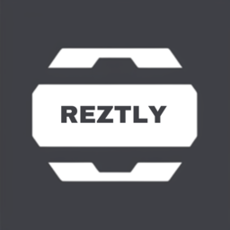
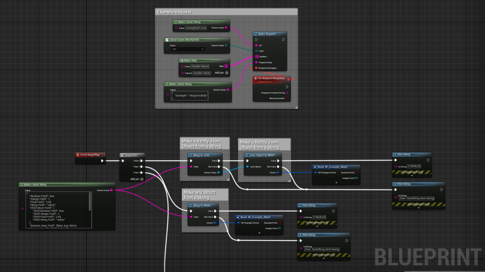
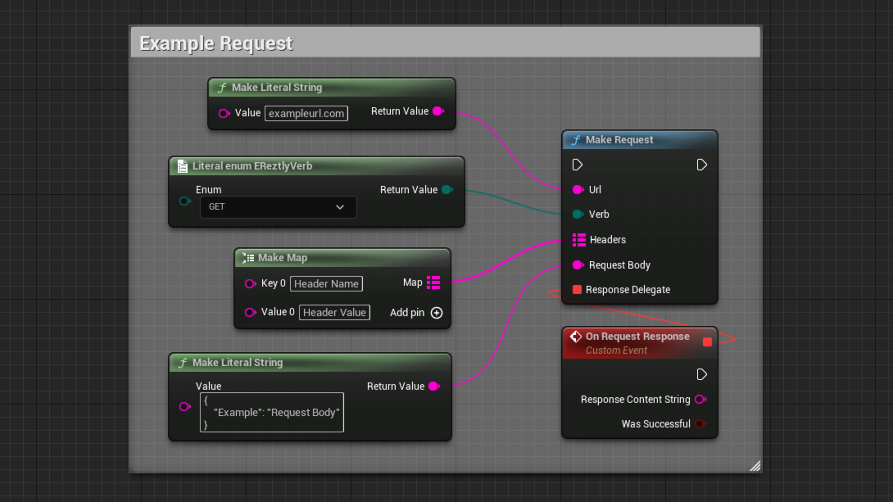
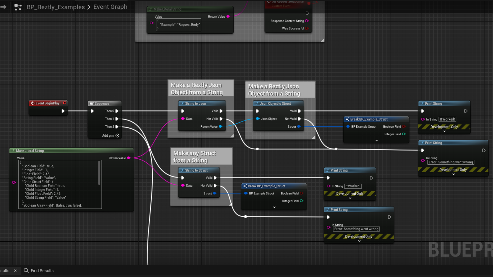
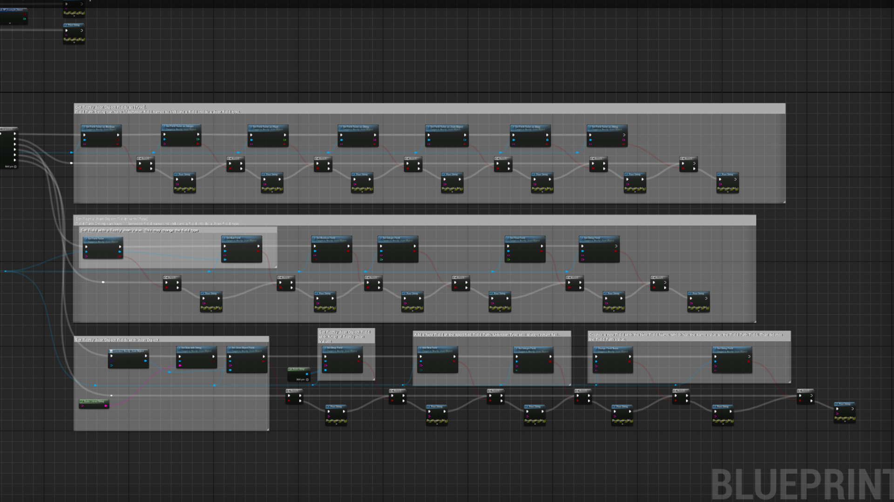

<a name="readme-top"></a>

<!-- PROJECT LOGO -->
<br />
<div align="center">
  <a href="https://github.com/MatthewDZane/Reztly">
    
  </a>

  <h3 align="center">Reztly Plugin</h3>

  <p align="center">
    An Unreal Engine plugin for interacting with Rest API, performing Http Requests, and parsing Jsons!
    <br />
    <a href="https://github.com/MatthewDZane/Reztly"><strong>Explore the docs »</strong></a>
    <br />
    <br />
    <a href="https://github.com/MatthewDZane/Reztly">View Demo</a>
    ·
    <a href="https://github.com/MatthewDZane/Reztly">Report Bug</a>
    ·
    <a href="https://github.com/MatthewDZane/Reztly">Request Feature</a>
  </p>
</div>


<!-- TABLE OF CONTENTS -->
<details>
  <summary>Table of Contents</summary>
  <ol>
    <li>
      <a href="#about-the-project">About The Project</a>
      <ul>
        <li><a href="#built-with">Built With</a></li>
      </ul>
    </li>
    <li>
      <a href="#getting-started">Getting Started</a>
      <ul>
        <li><a href="#installation">Installation</a></li>
      </ul>
    </li>
    <li><a href="#usage">Usage</a></li>
    <li>
      <a href="#how-it-works">How It Works</a>
      <ul>
        <li><a href="#reztly-function-library">Reztly Function Library</a></li>
        <li><a href="#reztly-json-object">Reztly Json Object</a></li>
        <li><a href="#reztly-json-value">Reztly Json Value</a></li>
        <li><a href="#response-delegate">Response Delegate</a></li>
      </ul>
    </li>
    <li><a href="#roadmap">Roadmap</a></li>
    <li><a href="#license">License</a></li>
    <li><a href="#contact">Contact</a></li>
    <li><a href="#acknowledgments">Acknowledgments</a></li>
  </ol>
</details>


<!-- ABOUT THE PROJECT -->
## About The Project

<div align="center">
  <a href="https://github.com/MatthewDZane/Reztly/Images/Example.png">
    
  </a>
</div>

This project is an Unreal Engine 5 Plugin that provides a convenient Blueprints
system for making Rest API Requests and handling Jsons. Written in C++ and 
exposed to Blueprints, the content ports functionality from the Http, Json, and
Json Utilities module for general use. You can easily set up a Rest Request 
with any url, any Request Verb, custom Request Headers, and custom Request Body
Content. Provides Nodes to convert Json Strings to any struct and any struct to
a String. Also includes the Reztly Json Object and Reztly Json Value object 
types, which server as a wrapper class for the c++ only JsonObject and JsonValue
types respectively.

Please contact 
[matthewzane.unrealengine@gmail.com](matthewzane.unrealengine@gmail.com)
for requests for additional functionality and for access to the 
[github repository](https://github.com/MatthewDZane/Reztly).

<p align="right">(<a href="#readme-top">back to top</a>)</p>


### Built With

This project is built with the following libraries. 

* [Unreal Engine 5](https://www.unrealengine.com/en-US/unreal-engine-5)
* [Unreal Engine HTTP](https://docs.unrealengine.com/5.1/en-US/API/Runtime/HTTP)
    - [HTTP Tutorial](https://dev.epicgames.com/community/learning/tutorials/ZdXD/call-rest-api-using-http-json-from-ue5-c)
* [Json](https://docs.unrealengine.com/5.1/en-US/API/Runtime/Json/)
* [Json Utilities](https://docs.unrealengine.com/5.1/en-US/API/Runtime/JsonUtilities/)

<p align="right">(<a href="#readme-top">back to top</a>)</p>


<!-- GETTING STARTED -->
## Getting Started

To get a local copy up and running follow these simple steps.

### Installation

_Below are instructions on how to setup the Unreal Engine IOS QR Code Reader plugin._
Note: These instruction are for a manual installation of the plugin. If you would like to skip this section, please install the plugin from the Unreal Marketplace. 
1. Ensure that there is a "Plugins" folder.
2. Copy the plugin into the "Plugins" folder. Make the plugin's folder is still named "Reztly". If you have access to the private repository and your project is also in a Git repository, the plugin can be added as a submodule.
```
git submodule add https://github.com/MatthewDZane/UnrealEngineIOSQRCodeReader.git Plugins/IOSQRCodeReader
```
3. Right click the Unreal Project .uproject file and choose the "Generate Visual Studio project files" options.
4. Open the generated .sln file using an IDE of your choice and build the project.
5. Now you are ready to utilize and develop with the plugin.

<p align="right">(<a href="#readme-top">back to top</a>)</p>


<!-- USAGE EXAMPLES -->
## Usage
Note: There is a public repository which contains an 
[Example Unreal Engine Project](https://github.com/MatthewDZane/ReztlyExampleProject/)
for this plugin. Note: the example project is a blank project with no settings changed.

The Reztly plugin's main purpose is to make using Rest API Requests and handling Jsons easier in Blueprints. However, the plugin can also be used in C++ as well.

The main interfaces can be found in the following files:
- [ReztlyFunctionLibrary.h](https://github.com/MatthewDZane/Reztly/blob/main/Source/Reztly/Public/ReztlyFunctionLibrary.h)
- [ReztlyJsonObject.h](https://github.com/MatthewDZane/Reztly/blob/main/Source/Reztly/Public/ReztlyJsonObject.h)
- [ReztlyJsonValue.h](https://github.com/MatthewDZane/Reztly/blob/main/Source/Reztly/Public/ReztlyJsonValue.h)

Additionally, please take a look at the [Example Blueprint](https://github.com/MatthewDZane/Reztly/blob/main/Content/BP_Reztly_Examples.uasset) in the Reztly Plugin Content folder, provides
examples of the many uses of the Reztly Plugin in Blueprints.

Making Http Requests:
<div align="center">
  <a href="https://github.com/MatthewDZane/Reztly/Images/RequestExample.png">
    
  </a>
</div>

Handle String Response:
<div align="center">
  <a href="https://github.com/MatthewDZane/Reztly/Images/HandlingStringResponse.png">
    
  </a>
</div>

Using Jsons:
<div align="center">
  <a href="https://github.com/MatthewDZane/Reztly/Images/UsingJsons.png">
    
  </a>
</div>


<!-- HOW IT WORKS -->
## How It Works

### Reztly Function Library

The Reztly Function Library provides several static function that handle Rest API Request and structs.

Provides Static Blueprint Nodes that have wildcard struct pin which convert to/from any struct type.

Here are the links to the 
[ReztlyFunctionLibrary.h](https://github.com/MatthewDZane/Reztly/blob/main/Source/Reztly/Public/ReztlyFunctionLibrary.h)
and 
[ReztlyFunctionLibrary.cpp](https://github.com/MatthewDZane/Reztly/blob/main/Source/Reztly/Private/ReztlyFunctionLibrary.cpp)
files which include comments.

### Reztly Json Object

Acts as a wrapper class for the C++ FJsonObject class, porting over much of the functionality to Blueprints.

Here are the links to the 
[ReztlyJsonObject.h](https://github.com/MatthewDZane/Reztly/blob/main/Source/Reztly/Public/ReztlyJsonObject.h)
and 
[ReztlyJsonObject.cpp](https://github.com/MatthewDZane/Reztly/blob/main/Source/Reztly/Private/ReztlyJsonObject.cpp)
files which include comments.

### Reztly Json Value

Acts as a wrapper class for the C++ FJsonValue class, porting over much of the functionality to Blueprints.

Here are the links to the 
[ReztlyJsonValue.h](https://github.com/MatthewDZane/Reztly/blob/main/Source/Reztly/Public/ReztlyJsonValue.h)
and 
[ReztlyJsonValue.cpp](https://github.com/MatthewDZane/Reztly/blob/main/Source/Reztly/Private/ReztlyJsonValue.cpp)
files which include comments.

### Response Delegate

The Delegate parameter, in the above Blueprints examples, is the red parameter which connects with a red "Custom Event" node. In C++ is slightly more complicated to define and pass this "Custom Event", or "Delegate" in C++.

<div align="center">
  <a href="https://github.com/MatthewDZane/Reztly/Images/RequestExample.png">
    
  </a>
</div>

```
// FResponseDelegate defined in ReztlyResponse.h
DECLARE_DYNAMIC_DELEGATE_TwoParams(
	FResponseDelegate, 
	FString,
	ResponseContentString, 
	bool, 
	bWasSuccessful
);
```

This means that an FResponseDelegate requires a function, which has 
FString ResponseContentString and bool bWasSuccessful to bind with it. 

Here is an example of C++ code.

```
Reztly ReztlyExample;
FResponseDelegate Delegate;
Delegate.BindUFunction(ReztlyExample, FName("OnBearerTokenResponse"));
URestly::RequestBearerToken(Username, Password, APIURL, Delegate);
```

where Reztly::OnBearerTokenResponse is defined as:

```
void OnBearerTokenResponse(FString ResponseContentString, bool bWasSuccessful);
```

<p align="right">(<a href="#readme-top">back to top</a>)</p>


<!-- ROADMAP -->
## Roadmap

See the [open issues](https://github.com/MatthewZane/Reztly/issues) for a full list of proposed features (and known issues).

<p align="right">(<a href="#readme-top">back to top</a>)</p>


<!-- LICENSE -->
## License

Please read the license [here](https://github.com/MatthewDZane/Reztly/license.md).

<p align="right">(<a href="#readme-top">back to top</a>)</p>


<!-- CONTACT -->
## Contact

If you have any questions, issues, or requests, please contact me via my
LinkedIn or the email below.

Matthew Zane 
- [![LinkedIn][linkedin-shield]][linkedin-url]  [@matthewdzane](https://www.linkedin.com/in/matthewdzane/) 
- matthewzane.unrealengine@gmail.com

Plugin Project Link: [https://github.com/MatthewDZane/Reztly/](https://github.com/MatthewDZane/Reztly/)

Example Project Link: [https://github.com/MatthewDZane/ReztlyExampleProject/](https://github.com/MatthewDZane/ReztlyExampleProject/)

<p align="right">(<a href="#readme-top">back to top</a>)</p>


<!-- ACKNOWLEDGMENTS -->
## Acknowledgments

Thank you to [Qualcomm Intitute](https://qi.ucsd.edu/) for sponsoring this project!

<p align="right">(<a href="#readme-top">back to top</a>)</p>


<!-- MARKDOWN LINKS & IMAGES -->
<!-- https://www.markdownguide.org/basic-syntax/#reference-style-links -->
[contributors-shield]: https://img.shields.io/github/contributors/MatthewDZane/ReztlyPreview.svg?style=for-the-badge
[contributors-url]: https://github.com/MatthewDZane/Reztly/graphs/contributors
[forks-shield]: https://img.shields.io/github/forks/MatthewDZane/ReztlyPreview.svg?style=for-the-badge
[forks-url]: https://github.com/MatthewDZane/Reztly/network/members
[stars-shield]: https://img.shields.io/github/stars/MatthewDZane/Reztly.svg?style=for-the-badge
[stars-url]: https://github.com/MatthewDZane/Reztly/stargazers
[issues-shield]: https://img.shields.io/github/issues/MatthewDZane/ReztlyPreview.svg?style=for-the-badge
[issues-url]: https://github.com/MatthewDZane/Reztly/issues
[linkedin-shield]: https://img.shields.io/badge/-LinkedIn-black.svg?style=for-the-badge&logo=linkedin&colorB=555
[linkedin-url]: https://linkedin.com/in/matthewdzane
